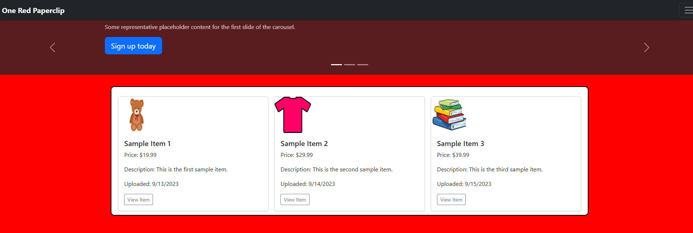

# One Red PaperClip

Online marketplace for buying and selling items

## Description

This Online marketplace full stack application will allow for users to buy, sell and post goods. Other users will be able to view those goods and decide if they would like to purchase those goods. The application solves the real-world problem of being able to search for particular goods that users want or need. Additionally, it will allow for users to sell goods as well. This web application will have a robust back end - with servers, databases, advanced APIs and user authentication. It will also have an intuitive front end.The web application utilizes Node.js, Express.js, Handlebars.js, MySQL, Sequelize ORM, GET and POST routes, Passport.js and will be deployed using Heroku. It has a polished UI, is responsive and interactive. It meets good-quality coding standards, and folder structure that meets the MVC paradigm.

## Accessing the Repo or Webpage:

- GitHub Repo URL: https://github.com/kevindimayuga/online-marketplace
- GitHub Pages WebPage Deployment URL: https://kevindimayuga.github.io/online-marketplace/
- Heroku Deployment URL: N/A

This project was done collaboratively between myself and two other developers and was originally created on the below repo and webpage URLs, I simply created the same repo in my own personal GitHub account and redeployed the webpage to my own GitHub Pages URL to showcase to others.
- GitHub Repo URL: https://github.com/sthogue/Online-marketplace
- GitHub Pages WebPage Deployment URL: n/a
- Heroku Deployment URL: https://one-red-paperclip-5102fbf3bf3c.herokuapp.com/

## Webpage Screenshot

## Table of Contents

- [Installation](#installation)
- [Usage](#usage)
- [Credits](#credits)
- [License](#license)
- [Badges](#badges)
- [Features](#features)
- [Contributions](#contributions)
- [Tests](#tests)
- [Contacts](#Contacts)

## Installation

The following steps were taken to complete the project:
- Review the purpose of the project, the user story and acceptance criteria
- Review the basics to creating a web and node application
- Review JavaScript, Node.js, Express.js, MySQL, Sequelize, Passport.js
- Create Professional README file
- Collaborate with group members to establish tasks/roles
- Write code
- Add website image/gif to README file
- Debug and review as needed
- Submit URL to GitHub Repo and link to Heroku deployment

## Usage

- Clone repo onto local device
- Open repo in local CLI
- Make sure node packages are installed by running `npm i` in the CLI
- Run `npm run seed` to seed the database
    - This will run `node seeds/index.js`
- Run `npm run start` in the CLI to start server
    - This will run `node server.js`
- Open up [localhost:3001](localhost:3001) in the browser to view the text editor application
- Pull up the homepage for the online marketplace
- Click on the nav bar to go to any of the following pages: 'Home', 'Login', 'Sign Up' or 'About'
- Once signed up and/or logged in, you will be able to create an item that you are looking to sell (with an item name, price, description)
- You will also be able to view other items that are for sale if you'd like to buy them and find contact information to message the seller

## Credits

We used the following resources to help guide us to complete the project:

- [MDN](https://developer.mozilla.org/en-US/)
- [W3Schools](https://www.w3schools.com/)
- [Professional README Guide](https://coding-boot-camp.github.io/full-stack/github/professional-readme-guide)
- [Node.js Introduction](https://www.w3schools.com/nodejs/nodejs_intro.asp)
- [Express.js](https://expressjs.com/)
- [Sequelize](https://sequelize.org/)
- [handlebars](https://handlebarsjs.com/)
- [MVC: Model, View, Controller](https://www.codecademy.com/article/mvc)
- [MySQL Tutorial](https://www.w3schools.com/MySQL/default.asp)
- [Passport Documentation](https://www.passportjs.org/docs/)

## License

- [MIT](https://opensource.org/license/mit/)

## Badges

## Features

N/A

## Contributions

N/A

## Tests

N/A

## Contacts

Stephen Hogue
- GitHub: [sthogue](https://github.com/sthogue)
- Email: sthogue16@gmail.com

Steven Weede
- GitHub: [BabyStu](https://github.com/BabyStu)
- Email: Stevenweede@yahoo.com

Kevin Dimayuga
- GitHub: [kevindimayuga](https://github.com/kevindimayuga)
- Email: k.dimayuga22@gmail.com